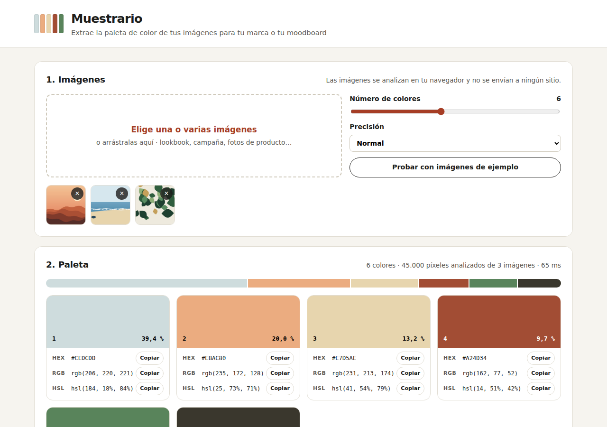

# Muestrario · Extractor de paletas de color para marca y moodboard

<!-- INSIGNIA DOI: se añadirá aquí después de publicar la versión 1.0.0 en Zenodo -->

Herramienta web que extrae los **colores dominantes** de una o varias imágenes (un lookbook, una campaña, fotos de producto) con un algoritmo de agrupación **k-means programado en JavaScript**. Muestra la paleta con sus códigos, compone un **moodboard**, indica qué **combinaciones de la paleta tienen contraste suficiente para texto** y exporta la paleta en **PNG, variables CSS y JSON**.



**Demo:** https://martamerchan.github.io/extractor-paletas-color/

## Funcionalidades

- Carga de **una o varias imágenes** (hasta 12), eligiéndolas o arrastrándolas.
- **Extracción de la paleta con k-means**, de 3 a 10 colores y con tres niveles de precisión.
- **Paleta ordenada por presencia**, con una barra que muestra la proporción de cada color y los códigos **HEX, RGB y HSL** con botón de copiar.
- **Moodboard** con las imágenes y la franja de la paleta, con título editable y descargable en PNG.
- **Combinaciones para texto:** todas las parejas texto/fondo de la paleta, ordenadas por contraste y clasificadas según WCAG 2.1 (AAA, AA, solo títulos o no cumple).
- **Exportación de la paleta** en PNG, como variables CSS (`--color-1`, `--color-2`…) y en JSON.
- Imágenes de ejemplo para probarla.

## Cómo usarlo

1. Abre la [demo](https://martamerchan.github.io/extractor-paletas-color/) y carga tus imágenes, o pulsa **Probar con imágenes de ejemplo**.
2. Ajusta el **número de colores** y la **precisión**. La paleta se recalcula al momento.
3. Copia los códigos que necesites o descarga la paleta en **PNG**, **CSS** o **JSON**.
4. Pon un título al **moodboard** y descárgalo.
5. Consulta las **combinaciones para texto** antes de usar dos colores de la paleta como texto y fondo.

## Cómo funciona el algoritmo

1. **Muestreo.** Cada imagen se reduce (a 100, 200 o 320 píxeles de lado, según la precisión) y se toman sus píxeles, descartando los transparentes. Todas las imágenes aportan un número parecido de píxeles, para que una imagen grande no domine la paleta.
2. **Espacio de color CIELAB.** Los píxeles se pasan de RGB a CIELAB. En este espacio la distancia entre dos colores se parece a la diferencia que percibe el ojo humano, así que los grupos salen más coherentes que agrupando en RGB.
3. **Inicio k-means++.** El primer centro se elige al azar. Cada centro siguiente se elige con una probabilidad proporcional al cuadrado de su distancia al centro más cercano ya elegido, así que los grupos empiezan bien repartidos.
4. **Iteraciones.** Cada píxel se asigna al centro más cercano y cada centro se recalcula como la media de sus píxeles. Se repite hasta que los centros se mueven menos de 0,5 unidades o se llega a 40 iteraciones.
5. **Resultado.** El color de cada grupo es la media RGB de sus píxeles, y su presencia es el porcentaje de píxeles del grupo. La paleta se ordena de mayor a menor presencia.

El generador de números aleatorios usa una **semilla fija**, así que las mismas imágenes dan siempre la misma paleta.

**Contraste:** relación WCAG 2.1 `(L1 + 0,05) / (L2 + 0,05)` con la luminancia relativa de cada color. Niveles: AAA ≥ 7:1, AA ≥ 4,5:1, solo títulos (texto grande) ≥ 3:1.

## Formato de exportación

**CSS**

```css
:root {
  --color-1: #cedcdd; /* rgb(206, 220, 221) · hsl(184 18% 84%) · 39,4 % */
  --color-2: #ebac80; /* … */
}
```

**JSON**

```json
{
  "generador": "Muestrario",
  "fecha": "2026-09-22",
  "colores": [
    { "nombre": "color-1", "hex": "#cedcdd", "rgb": [206, 220, 221], "hsl": [184, 18, 84], "proporcion": 0.394 }
  ],
  "combinacionesTexto": [
    { "texto": "#cedcdd", "fondo": "#3a372d", "contraste": 8.45, "nivel": "AAA" }
  ]
}
```

## Tecnologías

- HTML5, CSS3 y JavaScript, **sin librerías**: el algoritmo k-means y las conversiones de color están programados desde cero.
- API Canvas 2D para leer los píxeles y generar los PNG.
- Sin servidor ni proceso de compilación: se publica con GitHub Pages.

## Estructura del proyecto

```
extractor-paletas-color/
├── index.html          Página principal
├── css/estilos.css     Estilos y diseño responsive
├── js/color.js         Conversiones RGB, HEX, HSL y CIELAB, y contraste WCAG
├── js/kmeans.js        Muestreo de píxeles y algoritmo k-means++
├── js/exportar.js      PNG de la paleta y del moodboard, CSS y JSON
├── js/app.js           Carga de imágenes, interfaz y copiado
├── ejemplo-1.jpg       Imagen de ejemplo (ilustración generada)
├── ejemplo-2.jpg       Imagen de ejemplo (ilustración generada)
├── ejemplo-3.jpg       Imagen de ejemplo (ilustración generada)
├── captura.png         Captura de pantalla para este README
├── CITATION.cff        Datos de cita (autoría, versión y fecha)
└── LICENSE             Licencia MIT
```

## Privacidad

**Todo se procesa en local, en tu navegador.** Las imágenes no se suben a ningún servidor: se leen y se analizan en la propia página, y desaparecen al cerrarla. La herramienta no usa cookies, analítica ni recursos de terceros.

## Imágenes de ejemplo

`ejemplo-1.jpg`, `ejemplo-2.jpg` y `ejemplo-3.jpg` son **ilustraciones ficticias** generadas por ordenador (un paisaje, una playa y hojas) para probar la herramienta. No son fotografías reales ni pertenecen a ninguna marca.

## Licencia

Publicado con licencia [MIT](LICENSE). Puedes usarlo, modificarlo y redistribuirlo libremente, manteniendo el aviso de copyright.

## Autora

**Marta Merchán Albano**, 2026.

Desarrollado con asistencia de herramientas de inteligencia artificial. Diseño, personalización, pruebas y publicación: Marta Merchán Albano.

Si utilizas esta herramienta en un trabajo, puedes citarla con los datos de [`CITATION.cff`](CITATION.cff) (botón **Cite this repository** de GitHub).
